# Remote sensing, democratizing data


##


## 

```{r, echo=F}
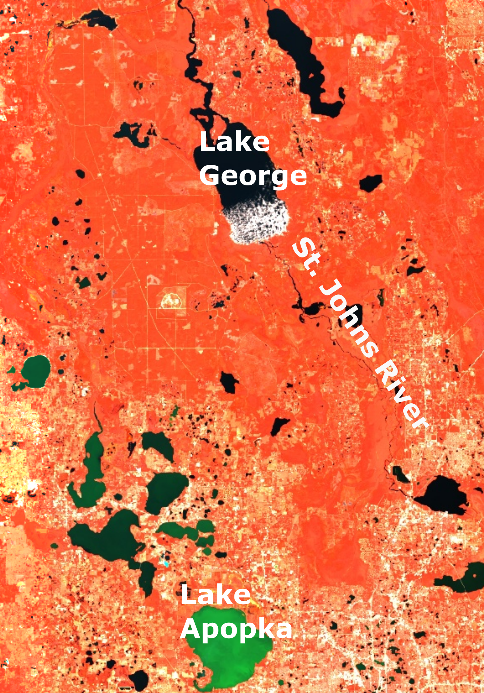
```


## 

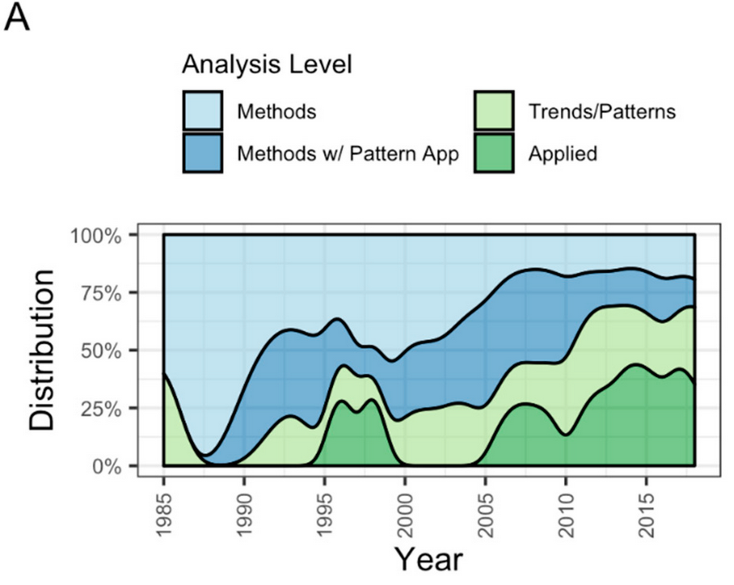


## Dissonance to harmony


## 

<iframe width="100%" height="750" src="https://www.youtube.com/embed/6LZURaRH3Ws" frameborder="0" allow="accelerometer; autoplay; encrypted-media; gyroscope; picture-in-picture" allowfullscreen></iframe>


# People like CSVs and Shapefiles, not raster stacks

## RiverSR (John Gardner)

##


## How are America's rivers changing color? 

[Lead by John Gardner](https://cuahsi.shinyapps.io/RiverColor/)


## LimnoSAT (Simon Topp)

- RiverSR but LimnoSAT? 
- Same idea, image stacks over 50,000 USA lakes

##


# Constituent prediction with AquaSat

## What are the dominant controls of sediment in the Colorado River? 
  
*Work with Matt Cohen and Jim Jawitz*

## Science along (not in) rivers

##

<iframe src="https://drive.google.com/file/d/1N8Vm3IcG1yNpcfg1WywxzPQh3kjmG_UU/preview" width="100%" height="750"></iframe>

##

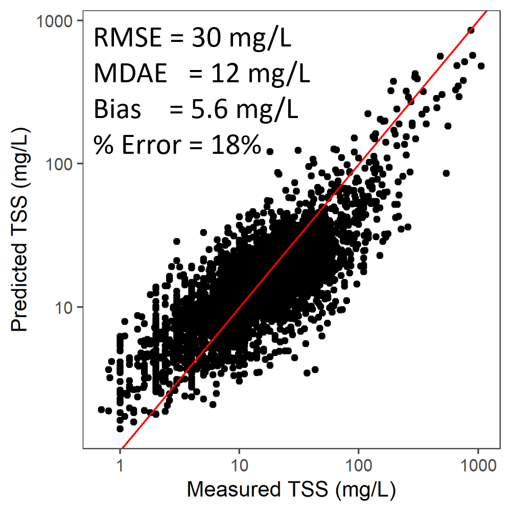


##

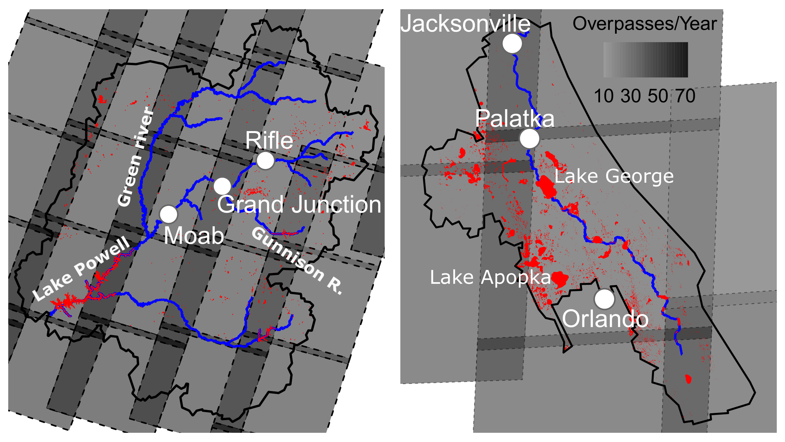


## 

<embed src="images/tss.zoom.html" style="width:100%; height: 800px;">


## 

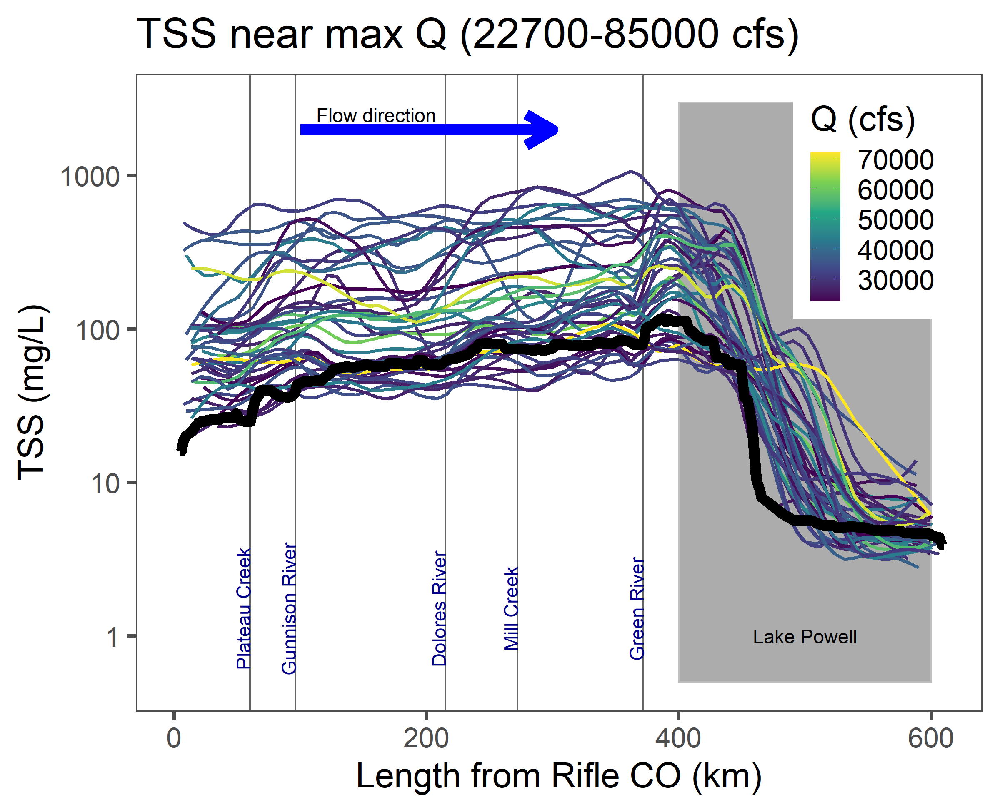


##

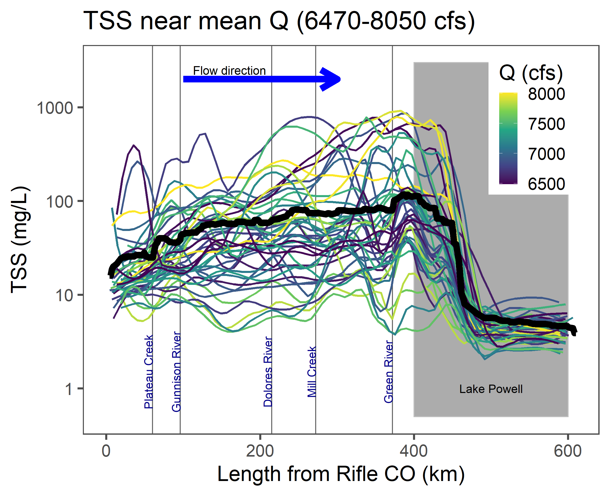


## How have macrophytes come to dominate the Loire river? 


*Work with Gilles Pinay, Florentina Moatar, Jake Diamond, Matt Cohen, John Gardner*

## 

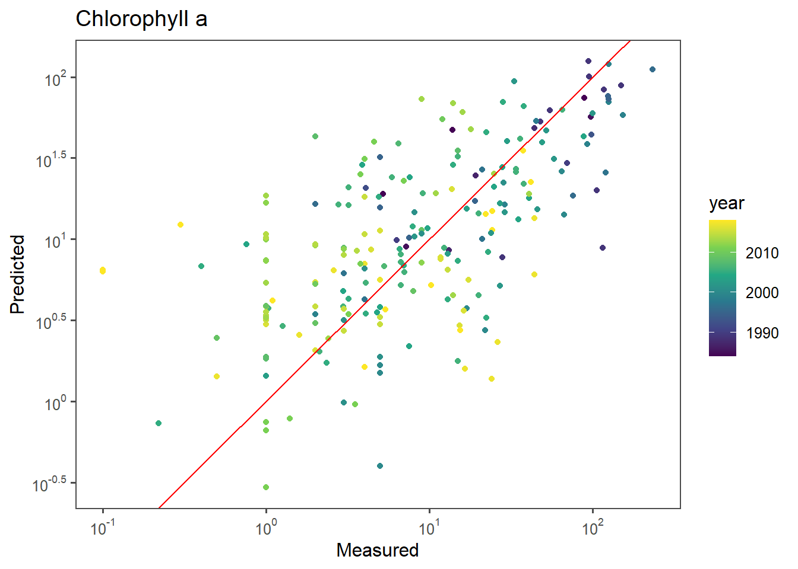


##

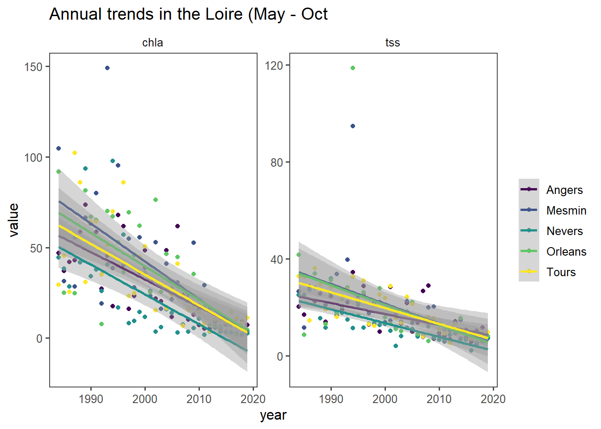

##

<iframe src="https://drive.google.com/file/d/1WGulcwuskzIibl9D7E2gVa6tB09Y2cXH/preview" width="100%" height="700"></iframe>


## Smaller, clearer lakes

*Lead by Simon Topp, UNC Chapel Hill*

##

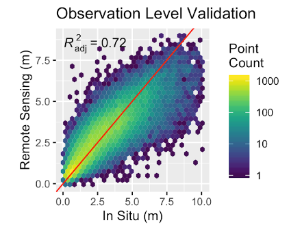


##

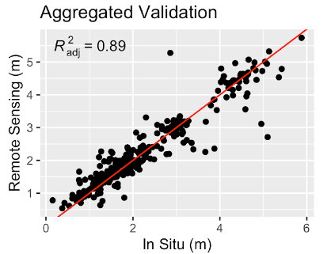


##

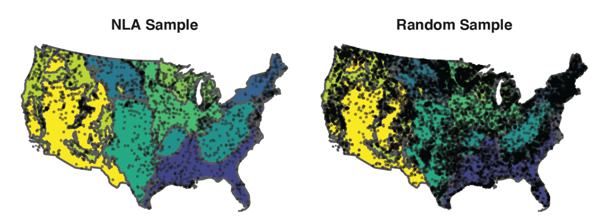

##

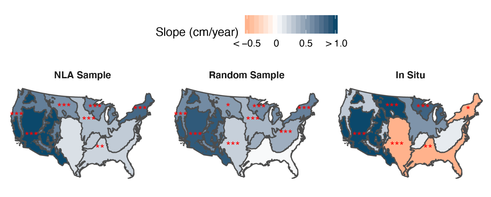


# Next Steps

## AquaSat 2.0

- Global 
- Landsat 8 + Sentinel 2
- More constituents (TP, TN, Phycocyanin, etc...)
- More reproducible!
- More tutorials!
- PGDL and network aware predictions
- What else would you like to see? 


# Other projects I'm excited about

## Beyond bespoke watershed ecosystem studies

<iframe src="images/network_map.html" width="100%" height="750px"></iframe>


## 

[Macrosheds](https://cuahsi.shinyapps.io/macrosheds/)


